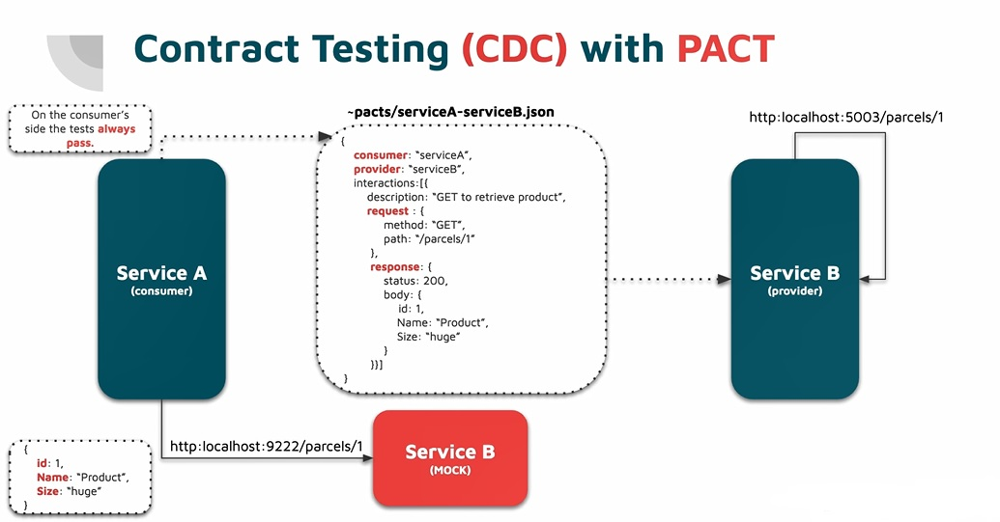

we don't see this in monolith apps and mostly we use this testing in microservices. this is implication of this fact that we don't have shared contract and we have local copy and so it would be nice if we have some sort of tests that we insurance that both side of consumer and provider side have match properties name of something.

so we need 2 parties, some one expose public api and public contract, let say in web api like dtos and also we need consumer.

now for example we have service A and service B, at first we need to provide service B `mock`, if we follow `pact` strategy for testing first in consumer side we run some sort of mock for service B for the provider and then we will actually do this let say fake call with this particular endpoint and the result should be some sort of file that would be a json file that would definition for contract so pact generated on consumer side with whole expectation about particular the endpoint and in this case and in this pact we have name of consumer and name of provider and then we have list of `interactions` we have this interaction which describe this GET and retrieve particular product and this is endpoint and this is response that I expect. so from consumer perspective, pact is about consumer driven testing so consumer is always right, running test in first phase in consumer side should be always succeed to make this test pass and as a result we have a json file for definition of pact and now we are moving to the step 2 which would be on the provider side and what the provider do is taking this definition for pact and uses data inside to actually call itself and check whether the response that we provide matches the expectation so if yes then we have match on the contract side and if no then provider broke this pact and its public contract and let some further fixing and in provider side this test not always be green.



[https://github.com/snatch-dev/Pactify](https://github.com/snatch-dev/Pactify)

whole process is not hard to actually implement because if we think about whole process this is just generating json file based on some definition inside my test in consumer side and then just using capabilities of end to end testing to actually perform proper http call to web api. so for this purpose we use `pactify` and we use this to `consumer driven testing` and pactify uses same naming convention as pact and we can use this with pact tools.

lets see hoq we can using this contract testing, where is consumer and where is provider? we check integration between `parcel` and `order`. we start consumer which in this case is `order` so if we go to `order` service and see the test there is already implemented test scenario for this so definition is pretty basic, what we do have is:

first we have options and in this options we specified `casing` and other one is `ignoring values` now we use a fluent api to produce json, we use `PactMaker` and pass our options and specify which microservices we want to define pact and the we start for `interactions` and for now we just focus on one interaction so we follow convention `given` and `then` so if `existing parcel` what to we want to achieve is `a get request to retrieve parcel detail` and its just like a description not like some magic and the what want to perform that is `GET` method with a `endpoint` and what is expected response we expect 200 or ok and particular body type and in generic parameter it get the shape of body with assume its value for all properties are default since we don't `care` about values we can also pass a body object with its all properties value and the end we publish it as a file in specific `path`

```csharp
var options = new PactDefinitionOptions
{
    IgnoreCasing = true,
    IgnoreContractValues = true
};

await PactMaker
    .Create(options)
    .Between("orders", "parcels") //consumer --> provider
    .WithHttpInteraction(b => b
        .Given("Existing parcel")
        .UponReceiving("A GET request to retrieve parcel details")
        .With(request => request
            .WithMethod(HttpMethod.Get)
            .WithPath($"/parcels/{ParcelId}"))
        .WillRespondWith(response => response
            .WithHeader("Content-Type", "application/json")
            .WithStatusCode(HttpStatusCode.OK)
            .WithBody<ParcelDto>())
    .PublishedAsFile("../../../../../../pacts")
    .MakeAsync();

```

and this our generated file in `pacts` folder

```json
{
  "consumer": {
    "name": "orders"
  },
  "provider": {
    "name": "parcels"
  },
  "interactions": [
    {
      "provider_state": "Existing parcel",
      "description": "A GET request to retrieve parcel details",
      "request": {
        "method": "GET",
        "path": "/parcels/c68a24ea-384a-4fdc-99ce-8c9a28feac64"
      },
      "response": {
        "headers": {
          "content-Type": "application/json"
        },
        "status": 200,
        "body": {
          "id": "00000000-0000-0000-0000-000000000000",
          "name": null,
          "variant": null,
          "size": null
        }
      }
    }
  ],
  "options": {
    "ignoreCasing": true,
    "ignoreContractValues": true
  }
}
```

no we can move to provider side, in provider side it's a little complicated and in `ParcelsApiPactConsumerTests` class, in arrange phase we don't want to use production database we need to actually something we need to something to test then clean it up. so we can usage of `MongodbFixture` so in arrange section we can see the definition for particular parcel that we will insert and then we have and then in construction init our MongodbFixture and httpclient from the `TestServer`, this is another approach how we can actually make a integration test in asp.net core and pretty much is up to us whether we use this one or `ApplicationFactory` but basically we create httpclient

[Testing an ASP.NET Core application using TestServer](https://www.meziantou.net/testing-an-asp-net-core-application-using-testserver.htm)

[Test ASP.NET Core middleware - TestHost](https://docs.microsoft.com/en-us/aspnet/core/test/middleware?view=aspnetcore-5.0)

```csharp
public ParcelsApiPactProviderTests()
{
    _mongoDbFixture = new MongoDbFixture<ParcelDocument, Guid>("test-parcels-service", "parcels");
    var testServer = new TestServer(Program.GetWebHostBuilder(new string[0]));
    testServer.AllowSynchronousIO = true;
    _httpClient = testServer.CreateClient();
}
```

if go to test `Pact_Should_Be_Verified` the first line is a simple insertion, insert parcel with particular Id to mongodb then we actually try to do this get and we will have some data in our database, id in here is the same on the consumer side but pactify also supports tempting so value of this id will not necessary to be the same, now provider side run the `verifier`, first we need to pass client created by test server and need to define between whom we will have verification and what directory we should grab the json file  

```csharp
private readonly ParcelDocument Parcel = new ParcelDocument
{
    Id =  new Guid("c68a24ea-384a-4fdc-99ce-8c9a28feac64"),
    Name = "Product",
    Size = Size.Huge,
    Variant = Variant.Weapon,
    CreatedAt = DateTime.Now
};

[Fact]
public async Task Pact_Should_Be_Verified()
{
    await _mongoDbFixture.InsertAsync(Parcel);

    await PactVerifier
        .Create(_httpClient)
        .Between("orders", "parcels")
        .RetrievedFromFile(@"../../../../../../pacts")
        .VerifyAsync();
}
```

it should verify when run the test and it didn't break pact. lets break our pact like change the id or structure of dto but we can also change the json file and modify consumer service level for example in consumer side we expect `id2` and now we have inconsistency will comes to definition 

``` json
"body": {
  "id2": "00000000-0000-0000-0000-000000000000",
  "name": null,
  "variant": null,
  "size": null
}
```
and now we can run again provider side, so in provider side we changed the dto and now the consumer couldn't get the data. with run we can see the error expected property `id2` not present and that is an issue. that is a way provider doesn't break any contract.

if we think about contract testing and this approach works fine because that was on our local machine, and that was shared disk space between consumer and provider, but because we have speared repositories on github that would not be possible so instead of putting file on disk we can do another approach that would be putting pact file in a external repository like service that responsible and with calling this service we can post pact and retrieve pact. so for this approach we use [PactBroker](https://github.com/pact-foundation/pact-broker-docker) that is a github project. it give us a server with web api which we can save and send our pact file. 


For a quick start with the `Pact Broker` and Postgres, we have an example [Docker Compose](https://raw.githubusercontent.com/pact-foundation/pact-broker-docker/master/docker-compose.yml) setup you can use:

Modify the docker-compose.yml file as required.
Run docker-compose build to build the pact_broker container locally.
Run docker-compose up to get a running Pact Broker and a clean Postgres database.
Now you can access your local broker:

curl -v http://localhost # you can visit in your browser too!

# SSL endpoint, note that URLs in response contain https:// protocol
curl -v -k https://localhost:8443

we comment `nginx` section in [docker-compose](https://raw.githubusercontent.com/pact-foundation/pact-broker-docker/master/docker-compose.yml) file and now it is accessible in `http://localhost:9292`, and we remove predefined pact now we need for both consumer and provider side use this pact registry. in consumer side we need to change one line to saving to through api rather than directory with `PublishViaHttp` and here we need to provide some dedicated url `http://localhost:9292/pacts/provider/parcels/consumer/orders/version/1.2.104` coming from [documentation](https://github.com/pact-foundation/pact_broker#how-would-i-use-the-pact-broker), so we need to know what's the url of internal pact broker docker api to send pact we can use docker dns or whatever and run our consumer test and refresh the `http://localhost:9292` page and we can see our pact info here.

``` csharp
 //.PublishedAsFile("../../../../../../pacts")
.PublishedViaHttp("http://localhost:9292/pacts/provider/parcels/consumer/orders/version/1.2.104", HttpMethod.Put)
.MakeAsync();
```
now lets do same for provider just modify this url `http://localhost:9292/pacts/provider/parcels/consumer/orders/latest` and now we need to change method for retrieving pact instead of getting this from disk we getting this pact from external registry adn change to `RetrieveViaHttp` method. and now we can get ride of pact folder that contains pact json file and run provider test one more time. that is the way how we can actually ensure this integrity and this none breaking changes for dtos, local contacts, messages, events, commands and so on. now if provider make some changes and breaks some public contacts specially when provider remove some fields or worst changing underlying types. to make sure involve this in our build pipeline, we start from consumer side once we actually do some changes in repository first thing we want to do is publish new pact to registry then run yourself as a provider for potential consumers it is something related to deployment.
