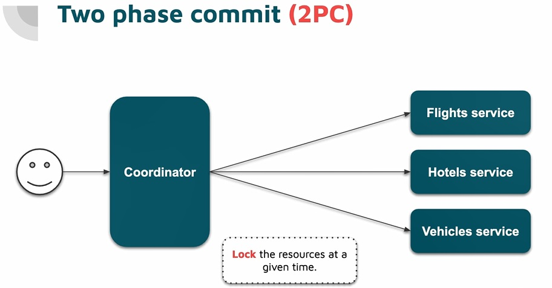
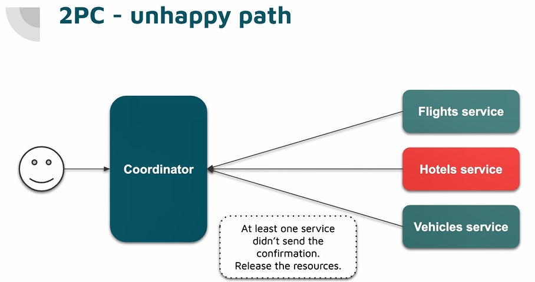
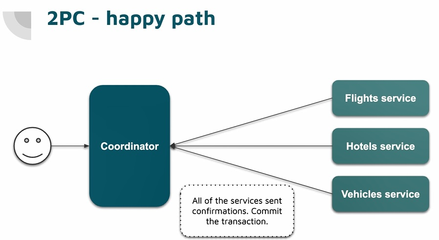
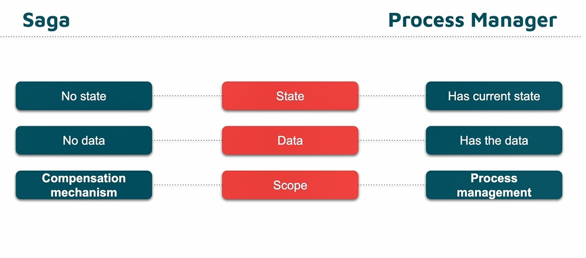
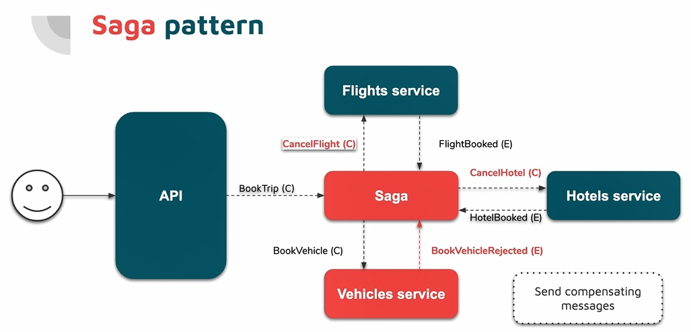

we need a transactional thing within whole system or services involve in particular business process and we have few ways to do this:

### 2PC

we think about whole booking process as a two phases,

in `phase one` we will have some sort of coordinator that will be some component or some piece of code that responsible for coordinating whole booking process so basically in `first phase` we send 3 parallel request to each microservices and we will simply ask to each service to book a resource (lock the resource), book a flight, book a hotel and book a vehicle that is phase one. now as a response we expect `yes` or `no`, are you capable doing this or not and we do a temporary locking the resources, if all parties can do locking the their resources coordinator start do actual business (phase 1 is like Locking the resource).

two possible scenario might be happened:

- first one is that are not all microservices capable of booking, let say there is no hotel available in particular range of date. so int his case coordinator create a second request that could be parallel to all services and say just unlock the resources that we currently locked and that is `phase two` and process will be finish with rejected state.

- second scenario all microservices are capable of doing this reservation, in first phase we lock the resource and this is not a actual booking and it is checking whether we are capable of dong this and this and we are temporary locking so if all services can be lock in transaction in phase 2 that all service agree lets do this that is actual business logic and book particular resource

so first phase is some thing like locking the resource for a while and checking whether we can do this and phase 2 would be rejecting this or perform actual business logic

[distributed-transactions-demos](https://github.com/GooRiOn/distributed-transactions-demos/)

[Improving microservices reliability – part 1: Two Phase Commit](https://www.davideguida.com/improving-microservices-reliability-part-1-two-phase-commit/)

[Patterns for distributed transactions within a microservices architecture](https://developers.redhat.com/blog/2018/10/01/patterns-for-distributed-transactions-within-a-microservices-architecture/)

[distributed-transactions-in-microservices](https://dotnetuniversity.com/distributed-transactions-in-microservices/)

here there some challenges, what happened when one of the services doesn't return anything and we probably have some sort of timeout because the `resource` may `locked` and `deadlock` forever and I can't book the hotel and it should be release (with a timeout mechanism we can release the resource).

in two phase commit we do this eventually locking resource, we can do this by adding one property `TransactionId` that is nullable so if it is null we know this particular resource is not involve in any `transaction` and if there is a value this means this resource locked by a transaction.

in some scenarios each microservices might `kill` for some reason and whole process will `stop` because we are waiting for response for all microservices, so when microservices started we need release the resource and we need some timeout and we need support this because it can't be locked forever. it like to `soft deletion`, once we create a soft delete entity we need a predicate that I want to filter the entities that has this property with value of `false`. the same situation needs to be in this approach, available resource from system perspective is the one that has `TransactionID` equal to `null` so there is extra code that we need to provide this approach work. and whole this request is `synchronous`, when we send a request `book a travel` we wait for this response synchronously and for example if for any reason one of microservices is down then our http request will failed or do some retry policy and overall process may fail.

assuming all microservices work an dwe have situation that two microservices respond quickly for example `10ms` but one have very heavy query, even thought this two microservices take 10ms we still need to to wait for third one to proceed further. so actual process time depend on this worst case.

### 2pc pro and cons

Advantages:

- easy to understand
- we have centralize business process manager (coordinator)
- synchronous communication - there is no message broker involved and we get immediate response whether this failed or not

Disadvantages:

- Require some additional code : if there is timeout, deadlocking we need some how handle this issues
- Overall processing time depends on the slowest service
- We need to lock the resources

this is also a issue when it comes to `modeling` because assuming that we need to provide this TransactionID to mark as a locked resource for `phase1` we need to have a business domain model with this transactionID and this transactionID. is part of our domain model? probably not. so we have to change our business entity only because we might have some `global transaction` with using `transactionID`, but we can do this better so we will use saga.

## Event Choreography

event choreography is based on events and message broker and it is async. in our system we have rabbitmq and we discuss with messages that are exchange across our system.

we start with a simple command and it could be like 3 parallel command in this case or could be step by step depends on the process. in this case we can be done in parallel. when we do parallel we need some extra work. in this approach we hae 1 command from api to flight service `BookFlight (C)` and we have some handler for handling this command and there will be `no locking` and we simply perform some domain logic. we seek for flight and book this as a result this particular command we will end up with a `Integration Event` or `External Event`, either `FlightBooked (E)` or `FlightBookRejected (E)` one of this two. the tricky part is that when we handle `FlightBooked` event handler inner our `hotel service` here we now some flight booked before and we can go further and next step and book our hotel inner this event handler we perform hotel booking logic and either hotel booked or an exception we raise either `HotelBooked` or `HotelBookRejected`. we could end up with 2 scenarios, vehicle service could produce a integration event which will be a `IEvent` or `IRejectedEvent` when we have no available vehicle we we should do a `rollback the transaction` and in this case both flight service and hotel service should also subscribe to this particular message `ReserveVehicleRejected` and eventually cancel reservation for hotel and flight and each of this service should subscribe to this rejected event and perform rejection for its own for flight and hotel or vehicle send something like `CancelHotel` and `CancelFlight` as a command.

this approach fit well with event driven architecture but it is like a messy solution and there is no centralize place which we can see definition for business process so we when we are new on the project and working fro example hotel service and we can see there is a event handler for `FlightBooked` and when ever some flight booked we also need a reservation for hotel why? actually the services business now are very coupled also when we look at the command that trigger whole process in this `BookFlight` command we have some additional staff like vehicle with this brand and `BookFlight` need some additional `payload` like the `BookTravel` that triggering first flight booking.

from developer perspective I want to `book the flight` and look at definition for particular command and I see why the payload contains `driver licence` or why flight service react with `BookTravel` command.

when we do some thing parallel like `BookHotel`,`BookFlight`,`BookVehicle` with 3 command parallel or send one `BookTravel` command again parallel and it contain all data related to different services but the issue that might have when we send this in parallel like two phase commit so we send 3 parallel command to each microservices and this is cool, it is faster because we don't have chain of responsibility so we don't have to wait until each microservices process the command, we do also have this natural code structure which we have command and command handler and event handler but `how is responsible` for this particular process and which event finishes whole process and we need to somehow wait for all these 3 events in other place, and this is api gateway responsibility to perform this and in this case that would some sort of 2 phase commit that we have one phase and coordinator is api gateway.

this is nice solution because we have event driven architecture but it probably doesn't look good for the scenarios where some events produces another events or commands and eventually we need to decide whether the whole process succeeded or we need `compensation` and we need some command and event to rollback possible failure within the whole scenario but because we don't have this we can't have responsibility of the services for example cancel the hotel because it shouldn't care about hotel like flight that shouldn't care about hotel at all and vice versa. if we have like a tree where we just publish event and another event cache some local data based on event payload and there is no actual transaction no like business process and more like broadcasting this event and other services broadcast more event and change database and payload and there is no global transaction top of it.

### Event Choreography Summary

Advantages:
- Easy to understand
- Doesn't require additional code: we have already handlers
- Fits into event-driven architecture

Disadvantages:
- No centralize place to manage the distributed process 
- Might result in "spaghetti" dependencies
- Difficult to test

what wil be cool if the we take two advantages of this event choregraphy and a coordinator a centralize place which we have definition for business process but also something fit pretty well with event driven architecture so combining these two would be pretty cool.and this is where saga process manager comes to play. 

### Saga (Orchestration)

saga is nothing more a compensation mechanism meaning is it just a simple router and get a message for example `CreateOrder` and then decide wether it should publish another message based on this message or maybe just perform a rollback action. so router get `message A` and maybe publish `message B` and it doesn't have `internal state` and doesn't have like a `data`. it is central place grab messages and then decide what should be next step and which message should be publish or maybe some another command or rollbacking command.

saga could built top of event choregraphy approach and the other hand we just plus a `process manager`.

[Process Managers, Coordinating Workflows, and Sagas](https://docs.microsoft.com/en-us/previous-versions/msp-n-p/jj591569(v=pandp.10)?redirectedfrom=MSDN)
[https://stackoverflow.com/questions/15528015/what-is-the-difference-between-a-saga-a-process-manager-and-a-document-based-ap](https://stackoverflow.com/questions/15528015/what-is-the-difference-between-a-saga-a-process-manager-and-a-document-based-ap)

[https://sunnyatticsoftware.com/blog/saga-vs-process-manager](https://sunnyatticsoftware.com/blog/saga-vs-process-manager)

[https://driggl.com/blog/a/process-manager-vs-saga-confusion](https://driggl.com/blog/a/process-manager-vs-saga-confusion)

[https://tech.signavio.com/2017/saga-workflow](https://tech.signavio.com/2017/saga-workflow)

[MassTransit State Machine Sagas using Automatonymous](https://www.youtube.com/watch?v=2bPumhSTigw)

process manager has state and can save it in its internal database or caching mechanism. we could have some sort of of state machine for keep track of what we actually do. so we can save any thing we want, maybe for a long running process we need to store some user detail and some addresses so we have `state` and `data` and we can manage whole process based on data and state.
these are two separate concept however bu if we look for some info about saga sometimes what false means about saga is mixing between something for `manage our process` and eventually do `compensation`.
what we mean will be some sort of  of mixing so when we talk about saga our mean is `saga / process manager` because we will be using both, `saga routing compensation` mechanism along with `process manager` state machine and this data for process management

in our booking sample, the request comes to API gateway and let say we send `BookTrip (C)` command to this `saga`, now it is a natural solution because we don't have information about the flight booking and vehicle booking and having this coordinator we can either start sending commands one by one or we could send them in parallel. because now since saga triggered or started by `BookTrip` command since saga is some sort of coordinator it is capable of doing this parallel because this is the place centralized which we could see the result. now by saga we send `BookFlight (C)` command and because we use message broker there is a queue for flight service and we subscribe to this `BookFlight (C)` command in flight service and BookFlightHandler start processing this command and eventually it will publish a event like whether is rejected or succeeded event and here it will publish `FlightBooked (E)` event and this event will receive by saga and we don't have ths dependency between flight service events and hotel service events and vehicle service events but we have a saga that react with this `FlightBooked` event and since saga is a router (process manager responsibility) it will decide, and it receive `FlightBook` event and now I can decide whether I want to be publish another command because there is a bigger process behind the scenes and let say saga send another command `BookHotel (C)` and same thing go applies to hotel service so we receive the `HotelBooked (E)` event and finally saga get this `HotelBooked` event and send another command `BookVehicle (C)` and in this point saga will await for last event to make this whole process and whole transaction completed and we either maybe successfully completed or rejected event.

Imagine process rejected in `vehicle service` for example there is no vehicle available now we have this rejected event and we need saga subscribe to this event `BookVehicleRejected (E)` so now this is where this `compensation mechanism` comes to play so in this particular state we can't perform this operation that was send by the user and we need to do this kinda rollback so what the saga would do is sending command to cancelling both `flight` and `hotel`. so we have this following approach same as we followed with event choregraphy we send same commands but right now there is clear single source of truth and single source of responsibility  when it comes to centralized process manager and saga actually send these commands to rollback whole transaction, with sending these two commands `CancelFlight (C)` and `CancelHotel (C)`. we can send them parallel or step by step depend on nature of the process. if there is no rejected event and we have `VehicleBookSucceeded (E)` event, our process manager job completed and whole transaction succeeded.

### Saga Pattern

Advantages:
- Easy to Understand
- Centralized business process manager
- Fit into the event-driven architecture
- tangible transaction (logs)
