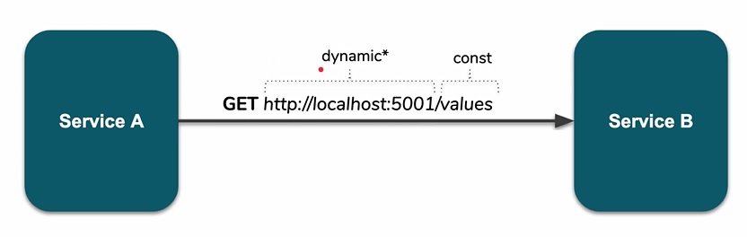

before do a reservation we need to check the customer's state, customer would be allowed to reserve the resource if its state is valid. so we need to some changes in our command handler for `ReserveResourceHandler`.

first idea is: we have `CustomerCreatedHandler` so we have this hook from customer microservice in our availability service. we can getting this message and caching this in availability side and there will be no need to call the customers service to check the state is valid or not. so within `CustomerCreatedHandler` we can subscribe to `CustomerCreated` event and extend this event with customer State property and save customer with state in local db for availability for prevent further request to customer microservice so we can subscribe to CustomerCreated event but we need also subscribe to all the events some how update the customer state for example CustomerStateChangedEvent so we have to subscribe to this event to listen to change like a integration event so we always have up to date local data for customer because we have event driven architecture. this is a eventually consistency.

```csharp
public class CustomerCreatedHandler : IEventHandler<CustomerCreated>
{
    public ILogger<CustomerCreatedHandler> Logger { get; }
    public CustomerCreatedHandler(ILogger<CustomerCreatedHandler> logger)
    {
        this.Logger = logger;

    }

    public Task HandleAsync(CustomerCreated @event)
    {
        // save customer with its state in local DB
        
        return Task.CompletedTask;
    }
}
```

but for some cases we need immediate consistency and we need to have latest data. and above approach because we use queue mechanism we let user and this customer reserve this even though within the customer service its state already changed to suspicious or band or invalid. in this case customer should allow to do reservation only state is valid and we can't rely on subscribe on the message because of its delay. and we want do it synchronously and wait for response and be sure customer data is fresh so because we do it synchronously via http or grpc or web sockets that are end-to-end or point to point. if customer service doesn't respond it is fine for us fail because it's more important for us to have consistent data than service always available.

we need a customerId in our `ReserveResource` command and after that we should change our `ReserveResourceHandler`

``` csharp
internal sealed class ReserveResourceHandler : ICommandHandler<ReserveResource>
{
    private readonly IResourcesRepository _repository;
    private readonly IEventProcessor _eventProcessor;
    private readonly ICustomerServiceClient _customersServiceClient;

    public ReserveResourceHandler(IResourcesRepository repository, IEventProcessor eventProcessor, ICustomerServiceClient customersServiceClient)
    {
        this._repository = repository;
        this._eventProcessor = eventProcessor;
        this._customersServiceClient = customersServiceClient;
    }

    public async Task HandleAsync(ReserveResource command)
    {
        var resource = await _repository.GetAsync(command.ResourceId);
        if (resource is null)
        {
            throw new ResourceNotFoundException(command.ResourceId);
        }

        //we ask customer state here synchronously because we want to immediate consistency rather that using event and eventually consistency
        
        //we certain int his moment we have latest data for customer service and we can continue reserve reservation.
        var customerState = await _customersServiceClient.GetStateAsync(command.CustomerId);
        if (customerState is null)
        {
            //application level exception
            throw new CustomerNotFoundException(command.CustomerId);
        }

        if (customerState.IsValid == false)
        {
            throw new InvalidCustomerStateException(command.CustomerId, customerState.State);
        }

        var reservation = new Reservation(command.DateTime, command.Priority);
        resource.AddReservation(reservation); 
        await _repository.UpdateAsync(resource); //database
        await _eventProcessor.ProcessAsync(resource.Events); //rabbit 
    }
}
```

here we need to inject HttpClienFactory in `ReserveResourceHandler` but if we do it in application level but just like we did for message broker we don't want explicitly say we rely on this message broker or this database so we should rather use some sort of abstraction so in application we create a port `ICustomerServiceClient` in `Services/Clients` folder

like local contract for events and commands we like to have local contract for `dtos` (internal point to point communication) and we don't want to have a shared package. so we create `external directory` in `Dto folder` and we create `CustomerStateDto`

```csharp
public class CustomerStateDto
{
    public string State { get; set; }
    public bool IsValid => State.Equals("valid", System.StringComparison.InvariantCultureIgnoreCase);
}
```

```csharp
//this is our port
public interface ICustomerServiceClient
{
    Task<CustomerStateDto> GetStateAsync(Guid id);
}
```

then we extend our logic for ReserveResourceHandler and we ask customer state here sonorously because we want to immediate consistency rather that using event and eventually consistency

```csharp
var customerState = await _customersServiceClient.GetStateAsync(command.CustomerId);
if (customerState is null)
{
    //application level exception
    throw new CustomerNotFoundException(command.CustomerId);
}

if (customerState.IsValid == false)
{
    throw new InvalidCustomerStateException(command.CustomerId, customerState.State);
}
```

we certain int his moment we have latest data for customer service and we can continue reserve reservation.

for handling exceptions we need to extend our `ExceptionToMessageMapper` for take these custom exceptions and using rabbitmq and asynchronous message processing.

now we need to implement actual implementation or adapter for this port (ICustomerServiceClient) so we move to Infrastructure layer and Create `Clients` directory and add `CustomerServiceClient`. here we can use `IHttpClientFactory` in our constructor and make a http call and deserialize the response. but here instead of `IHttpClientFactory` we use `IHttpClient` coming from `MicroBootstrap.HTTP` this is some sort of abstraction top of `HttpClient` of .net core with using:

```csharp
services.AddTransient<ICustomerServiceClient,CustomerServiceClient>();
services.AddHttpClient(clientName: "availability") //our abstraction top of httpclient
```

```csharp
internal sealed class CustomerServiceClient : ICustomerServiceClient
{
    private readonly IHttpClient _httpClient;
    public CustomerServiceClient(IHttpClient httpClient)
    {
        this._httpClient = httpClient;
    }
    public Task<CustomerStateDto> GetStateAsync(Guid id)
    {
        return _httpClient.GetAsync<CustomerStateDto>($"http://localhost:5002/customers/{id}/state"); //our customer service address
    }
}
```

here we hardcoded our customer service address but it will change when we deploy it in production mode, this work fine in our machine because all our microservices are in localhost but we want to deploy it some where in public world the host part will change. also customer microservices can be scale up and for example we have 2 instances of same customer microservice and how do we choose which instance make my call?

we how some issues when we use pint-to-point commination services in http protocol or another protocol like grpc.



here endpoint or query string will be a `constant` value but first part that service actually lives is a `dynamic` value and may change. when we talk about microservices and scale horizontally there maybe new dynamic assigned IP addresses and maybe new urls and that is very typical in cloud providers so we like some how take this dynamic part and make some one else to responsible for providing this part.
this is availability's service `responsibility` to actually be aware where the other microservices `lives` but in real scenario it is not responsibility of availability service and some one else is responsible for this. for the service it should be transparent that service shouldn't care whether it need some load balancing or not it just send a request to some point and expect the response.

here for making our httpclient better with using some setting for our httpclient and then we move further and use service discovery.

```json
  "httpClient": {
    "type": "",
    "retries": 3,
    "services": {
      "customers": "http://localhost:5002"
    }
  }
```

and here for using dynamic part of url we use this setting in our code with using `HttpClientOptions` and `Services` property.

```csharp
internal sealed class CustomerServiceClient : ICustomerServiceClient
{
    private readonly IHttpClient _httpClient;
    private readonly HttpClientOptions _httpClientOptions;
    private readonly string _url;

    public CustomerServiceClient(IHttpClient httpClient, HttpClientOptions httpClientOptions)
    {
        this._httpClientOptions = httpClientOptions;
        this._httpClient = httpClient;
        this._url = _httpClientOptions.Services["customers"];

    }
    public Task<CustomerStateDto> GetStateAsync(Guid id)
    {
        return _httpClient.GetAsync<CustomerStateDto>($"{_url}/customers/{id}/state");
    }
}
```

we solve one issue that is host part now is not longer `static` and we can override this in build server but still have an issue of scaling and how we can distribute this traffic between different services.
