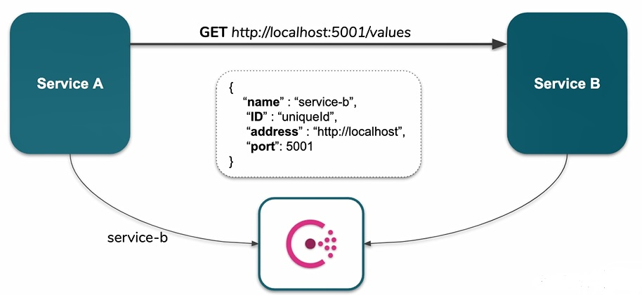

for the challenge of kept hard coded string whether it is in our class or appsettings we want somehow extract this configuration and ideally move it into separate tools or infrastructure and our services shouldn't be aware where other services are being deployed, what are ip addresses or dns and they should only request to a single place and they should some how properly to services they are trying to talk to.

we use `service discovery` and we start a tool like `consul`. 

### Service Discovery Mechanism
consul itself provides very lightweight API and provide us a registry for addresses so once the microservice send a request to consul with some registration data and in this case it could be the name of particular service, it treats like a `key` or `dns` some sort of `key` for `group of instances`. name is unique for all of instances of particular service that is like a `group name` and beside this each instance has its unique identifier(ID) and beside that we will provide connection data like host part and port.
so this is now each microservices responsibility to actually register in this service discovery.



now when service A needs to connect to service B, we will divide whole connection into two steps:

- service A will use this `service-b` dns or key to fetch data from consul and consul return same `registration data` for this requested key for service B the data about the potential instances and each of the have address and port. 
- the later based on this data consumer try to reach the receiver. 

actually we have 2 requests, first request would be, register give me all of instances of the service that i'm trying to talk to and then I have instances I can send another request to communicate the service.

consul itself can be setup either as a `client side` service discover or `server side` discovery. in the `client side discovery` it is client responsibility to actually do the `load balancing` for example consul return 3 instances so service A maybe reach the instance number 2 and this is its responsibility on the other hand in `server side service discovery` list of instances will be ordered by round robbin algorithm in consul, when we make a call doesn't matter which service make that call it just order them by round robbin and we take a instance that suggest by consul.

we use consul in our docker and we can reach it in `http://localhost:8500`, now we want to plugin our service in service registry. we can use service discovery feature to talk between services. first we need register customer microservice and in appsettings of customer service we have some setting for consul.

``` 
  "consul": {
    "enabled": true,
    "url": "http://localhost:8500",
    "service": "customers-service",
    //https://docs.docker.com/docker-for-windows/networking/#use-cases-and-workarounds
    //https://nickjanetakis.com/blog/docker-tip-65-get-your-docker-hosts-ip-address-from-in-a-container
	  //https://stackoverflow.com/questions/24319662/from-inside-of-a-docker-container-how-do-i-connect-to-the-localhost-of-the-mach
    //https://dev.to/natterstefan/docker-tip-how-to-get-host-s-ip-address-inside-a-docker-container-5anh
    //https://www.docker.com/blog/how-to-deploy-on-remote-docker-hosts-with-docker-compose/
    //https://docs.docker.com/engine/reference/commandline/run/#set-environment-variables--e---env---env-file
    //https://stackoverflow.com/questions/30494050/how-do-i-pass-environment-variables-to-docker-containers
    //https://stackoverflow.com/questions/24319662/from-inside-of-a-docker-container-how-do-i-connect-to-the-localhost-of-the-mach?page=1&tab=active#tab-top
    "address": "127.0.0.1", //host.docker.internal in docker desktop and 127.0.0.1 in wsl //docker host address in host network mode - this address will use inner of our consul container for access consul container can reach our customer service living on localhost 
    "port": "5002",
    "pingEnabled": true,
    "pingEndpoint": "ping",
    "pingInterval": 3,
    "removeAfterInterval": 3
  },
```
[Accessing Linux networking apps from Windows (localhost)](https://docs.microsoft.com/en-us/windows/wsl/compare-versions#accessing-linux-networking-apps-from-windows-localhost)

[Accessing Windows networking apps from Linux (host IP)](https://docs.microsoft.com/en-us/windows/wsl/compare-versions#accessing-windows-networking-apps-from-linux-host-ip)

[fix-wsl2-dns-resolution](https://gist.github.com/coltenkrauter/608cfe02319ce60facd76373249b8ca6)

`http://localhost:8500` in `url` section is api address of consul that hosted on docker and it `exposed` on docker host on the port `8500` and address `127.0.0.1` address because of its docker network type that is `host` for our container in docker compose [host-infrastructure.yml](../Pacco/compose/host-infrastructure.yml) in linux without docker desktop but if we use windows and docker desktop and bridge network for our docker-compose [infrastructure.yml](../Pacco/compose/infrastructure.yml) for docker host address we should use `host.docker.internal`

with type of [host network](https://docs.docker.com/network/host/) in our [host-infrastructure.yml](../Pacco/compose/host-infrastructure.yml) file if we use [bridge network](https://docs.docker.com/network/bridge/) instead of `host network` all of our container are isolated and in windows and mac on docker desktop we can access each docker [container host](https://docs.docker.com/docker-for-windows/networking/) with using `host.docker.internal` we use this [infrastructure.yml](../Pacco/compose/infrastructure.yml) docker compose file, and if we use bridge network with `linux` for access to docker host we can't use `docker.host.internal` and for [finding docker host](https://nickjanetakis.com/blog/docker-tip-65-get-your-docker-hosts-ip-address-from-in-a-container) we can connect over the IP address listed in our `docker0 network` adapter.
we can use `ip a` on our docker host to get host address also we can set it in our `DOCKER_HOST` environment variable.

we can also bind a dns name in hosts file for our docker host address like this:

``` bash
cat /etc/hosts

192.168.8.109   host.docker.internal
192.168.8.109   gateway.docker.internal
```

`customers-service` in `service` section is dns name of group name of our service for multiple instance and `address` and `port` are host and port address of our service, this address should be resolve on the consul docker container so we need to use a host address for docker here because our consul container can talk with our application that is on host out of docker by using `127.0.0.1` because we use host mode in docker for our containers.

[Using Consul for Service Discovery with ASP.NET Core](https://cecilphillip.com/using-consul-for-service-discovery-with-asp-net-core/)

[Using Consul for Health Checks with ASP.NET Core](https://cecilphillip.com/using-consul-for-health-checks-with-asp-net-core/)

[Looking At ASP.NET Core's IApplicationLifetime](https://khalidabuhakmeh.silvrback.com/looking-at-asp-net-cores-iapplicationlifetime)

[ASP.NET Core WebSockets and Application Lifetime Shutdown Events](https://weblog.west-wind.com/posts/2020/May/28/ASPNET-Core-WebSockets-and-Application-Lifetime-Shutdown-Events)

[ASP.NET Core In Production - Graceful Shutdown And Reacting To Aborted Requests](https://www.thinktecture.com/en/asp-net/aspnet-core-in-production-graceful-shutdown-and-reacting-to-aborted-requests/)

[IHostLifetime](https://docs.microsoft.com/en-us/aspnet/core/fundamentals/host/generic-host?view=aspnetcore-5.0#ihostlifetime)

services will be register in our consul and we can see these services in `http://localhost:8500` and inner our `customer-service` we can see all of the `instances` of `this services` and we can open each instance we can see defined `health check` and `tags` for our service instance. consul itself don't need health check but it is good for us because once we do a graceful shut down and do something we expect in .net core (ctr+c or send stop signal to host) we could `deregister` ourself from the consul registry but when we have a unexpected shutdown (like crash or kill app) in this case we have no option for `deregister` from consul and `health check` is only way from consul perspective I'm not access to this instance so I would simply `deregister` this, so potential consumer no longer use this instance.

for our service we setup health check in consul with define a health check endpoint in with override it in `appsettings.local.json` and this health check will add in `UseConsul`.

``` json
 "consul": {
    "enabled": true,
    "pingEndpoint": ""
}
```

we do same configuration for consul in `availability service` in `appsettings.json`

``` json
  "consul": {
    "enabled": true,
    "url": "http://localhost:8500",
    "service": "availability-service",
    "address": "host.docker.internal",
    "port": "5001",
    "pingEnabled": true,
    "pingEndpoint": "ping",
    "pingInterval": 3,
    "removeAfterInterval": 3
  },
```
and in `appsettings.local.json`

``` json
  "consul": {
    "enabled": true,
    "pingEndpoint": ""
  },
```

in `pingEndpoint` property we defined `ping` bu we don't have it and override it with `""` in local setting now we should define this `endpoint` in availability

``` csharp
 .Get("", ctx => ctx.Response.WriteAsync(ctx.RequestServices.GetService<AppOptions>().Name))
```
now we want to register customer service in consul and this will be a infrastructural concern and application layer doesn't care about `registry` , `discovery` , `load balancing` at all.
in extensions in our infrastructure layer and here we can call another extension `AddConsul` for register needed services for consul. it post a HttpPost to consul API and try to register itself. in this method it register a `HostedService` when our app does start it will register our service instance on consul registry with a HttpPut to register on the consul and when our app stopped our `HostService` do a graceful shutdown it will call `deregister` for this instance service. but when we killed or crashed we can't perform this graceful shutdown with calling deregister and we rely on `health check`.

this is first part `availability` and `customer` service registered on the registry, now how we can use this `registry` to `connection` between these services one to another?
we need to use web api to get list of instances for service and then we make a call to this service we will switch `original service url` to the one provided by consul.

in `CustomerServiceClient` lets look at or local.appsettings.json and config for `httpClient`

``` 
  "httpClient": {
    "type": "consul", //for create a custom  httpClient that can resolve by IHttpClient 
    "retries": 3,
    "services": {
      "customers": "http://localhost:5002"
    }
  }
```
with type `consul` and this is answer why we use abstraction top of HttpClient because change this property to consul will switch implementation injected to our `IHttpClient` and now we can use of consul registry.and it will register our IHttpClient with a custom `ConsulHttpClient` implementation with using also a message handler `ConsulServiceDiscoveryMessageHandler` on this HttpClient and `ConsulHttpClient` inherits from our custom HttpClient

``` csharp
services.AddHttpClient<IHttpClient, ConsulHttpClient>("consul")
.AddHttpMessageHandler<ConsulServiceDiscoveryMessageHandler>(); //before send a request to particular service we could add some headers or change the payload like middleware
```
before send a request to particular service we could add some headers or change the payload like middleware, inner this middleware before we send a request we ask consul to give us available instance and we override original request uri
we ask from registry to give us a instance of service from available instances (pick first from unused instance) 'client side load balancing' or some sort of work like load balancing and then override request address with one provide by consul.

so instead of send request to `localhost:5002` will use for address of our customer service we use a `key` in our appsettings.local.json like `customer-service` (name should equal with group name for our service in our consul registry) so it use ConsulHttpClient and a custom DelegatedHandler implementation and we will use this to fetch service instance from registry by using `customer-service` key

``` json
  "httpClient": {
    "type": "consul",
    "retries": 3,
    "services": {
      "customers": "customer-service"
    }
  }
```

now we run our availability service and then do an reserve resource with a api call in our availability service

``` json
@url = http://localhost:5001
@resourceId = 00000000-0000-0000-0000-000000000022
@customerId = c8ce5e16-ef93-48c3-9876-0e0efc981a88
@dateTime = 2020-01-10

POST {{url}}/resources/{{resourceId}}/reservations/{{dateTime}}
Content-Type: application/json

{
  "resourceId": "{{resourceId}}",
  "customerId": "{{customerId}}",
  "dateTime": "{{dateTime}}",
  "priority": 0
}
```
in `ReserveResourceHandler` and `_customersServiceClient.GetStateAsync()` the client that will inject into CustomerServiceClient is ConsulHttpClient and `_url` part of our get request will read from `_httpClientOptions.Services["customers"]` that is `customers-service` that is a key and full url will be `customers-service/customers/c8ce5e16-ef93-48c3-9876-0e0efc981a88/state` and after resolve this request if we look at to logs our request from ` http://customers-service/customers/c8ce5e16-ef93-48c3-9876-0e0efc981a88/state` will change with using HttpClient message handler to `http://localhost:8500/v1/agent/services?filter=Service=="customers-service"` and ask to consul to give use list of available service instances and then finally send the request to this particular service `http://localhost:5002/customers/c8ce5e16-ef93-48c3-9876-0e0efc981a88/state`.

``` csharp
//before we send a request we ask consul to give us a available instance and we override original request uri
request.RequestUri = await GetRequestUriAsync(request, serviceName, uri);
```

after we get service instances with filter with our `service key` we get list of all instances available and for example we pick first one with a client side load balancing (like round robin) and we just change the url from this key to actual ip address and redirect there and this solve the issues potential scale up and don't have knowledge where the microservices live abd we use key to group of services and consul use a key for responsibility of where the service is and what is the ip. consul is for service register and discovery or key value store but it can use load balancer too.

### Scaling Services in our Consul Regisry

[How to scale Docker Containers with Docker-Compose](https://brianchristner.io/how-to-scale-a-docker-container-with-docker-compose/)

[https://pspdfkit.com/blog/2018/how-to-use-docker-compose-to-run-multiple-instances-of-a-service-in-development/](https://pspdfkit.com/blog/2018/how-to-use-docker-compose-to-run-multiple-instances-of-a-service-in-development/)

[https://vegibit.com/dns-round-robin-in-docker/](https://vegibit.com/dns-round-robin-in-docker/)

[Nginx Load Balancing and using with Docker](https://levelup.gitconnected.com/nginx-load-balancing-and-using-with-docker-7e16c49f5d9)

[https://doc.traefik.io/traefik/user-guides/docker-compose/basic-example/](https://doc.traefik.io/traefik/user-guides/docker-compose/basic-example/)

[https://doc.traefik.io/traefik/getting-started/quick-start/](https://doc.traefik.io/traefik/getting-started/quick-start/)

[https://dev.to/cedrichopf/get-started-with-traefik-2-using-docker-compose-35f9](https://dev.to/cedrichopf/get-started-with-traefik-2-using-docker-compose-35f9)

[https://johnny.am/blog/simple-traefik-setup-with-docker-x5](https://johnny.am/blog/simple-traefik-setup-with-docker-x5)

[https://www.valentinog.com/blog/traefik/](https://www.valentinog.com/blog/traefik/)